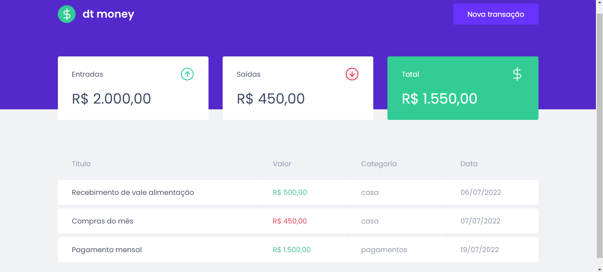
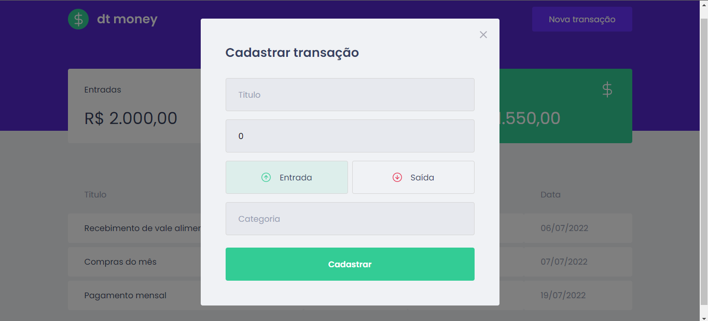

<div align="center">
	
  
</div>

## :dart: Objetivo

Projeto desenvolvido para por em prática os principais fundamentos da biblioteca React.js.

## :hammer_and_wrench: Ferramentas

- [axios](https://axios-http.com/ptbr/docs/intro)
- [miragejs](https://miragejs.com/)
- [polished](https://polished.js.org/)
- [react-modal](https://reactcommunity.org/react-modal/)
- [styled-components](https://styled-components.com/)
- [typescript](https://www.typescriptlang.org/)

## :desktop_computer: Padronização de código

- [Eslint](https://eslint.org/)
- [Prettier](https://prettier.io/)
- [EditorConfig](https://editorconfig.org/)

## :rocket: Executando o projeto

```bash
// Instale as dependências

yarn install

// Concluindo a instalação rode

yarn dev
```
